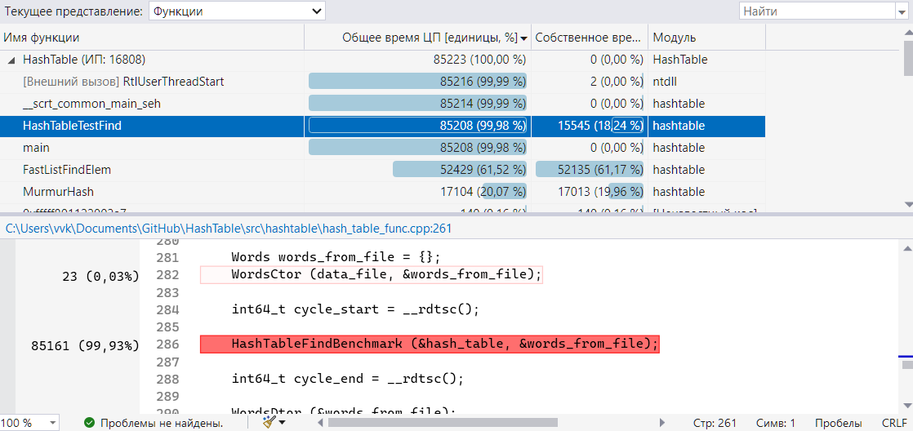
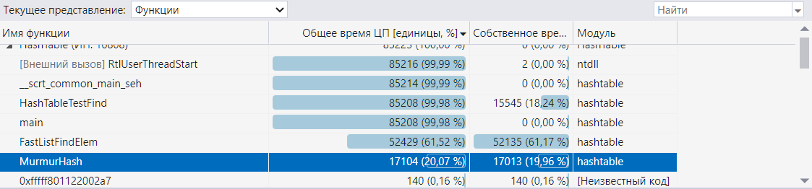

# Работа по хэш-таблице

Хэш-таблица - это такая структура данных, в которой вставка, поиск и удаление элемента происходит за $ O(1)$ в лучшем случае. Выглядит она так (картинка взята [отсюда](https://khalilstemmler.com/blogs/data-structures-algorithms/hash-tables/)):


### Общий принцип ее работы

Общий принцип ее работы таков: пусть мы вставляем элемент в хеш-таблицу. Как выбирается ячейка хэш-таблицы, в которую нужно вставить элемент? На вход хэш-функции поступает ключ (или слово), из которого хэш-функция получает некое числовое значение. Это числовое значение и будет являться номером ячейки хэш-таблицы, в которую стоит положить элемент. 

Для поиска и удаления алгоритм выбора ячейки хэш-таблицы такой же.

### Устройство нашей хэш-таблицы 

В качестве ячейки хэш-таблицы будет использоваться самописный двусвязный список. Сама хэш-таблица будет представлять из себя массив таких двусвязных списков. 

#### Функции нашей хэш-таблицы

Удаление элемента из хэш-таблицы нас интересовать не будет, такой функции поддерживаться не будет. 

Будет поддерживаться вставка и поиск элемента в хэш-таблице. 
В качестве элемента будет выступать слово. 

Вставка будет происходить таким образом, чтобы два одинаковых слова в хэш-таблице не встречалось (в одной ячейке не может быть два одинаковых слова). Следует уточнить, что значение, полученное хэш-функцией, может превосходить размер хэш-таблицы. В этом случае номер ячейки хэш-таблицы будет остаток от деления значения хэш-функции на размер хэш-таблицы.

Поиск элемента будет происходить по общему алгоритма поиска в хэш-таблице.

## Первая часть работы

### Цель первой части работы

Цель первой части работы заключается в исследовании распределения значений восьми хэш-функций. Подробнее см. ниже.

### Метод исследования

Для исследования будем использовать нашу хэш-таблицу. В качестве данных для вставки в хэш-таблицу возьмем набор слов, использующихся в произведении У.Шекспира "Гамлет, принц датский" (см. [hamlet.txt](src/hamlet.txt)). Это позволит нам исследовать поведение хэш-функций не на искусственно сгенерированных данных, а на реальных, что лучше. После вставки всех слов в хэш-таблицу необходимо будет сделать дамп населенности хэш-таблицы. Используя этот дамп, будем строить диаграмму населенности хэш-таблицы.

Работать будем с лоад-фактором (или населенностью) хэш-таблицы около 7. Это позволит нам лучше исследовать поведение хэш-функций, так как диапазон значений хэш-функций (в среднем) больше размера хэш-таблицы.

### Скрипт, считающий количество слов в тексте

Мой скрипт будет из текста делать файл, в котором на каждой строке будет находиться одно слово, при этом убирая различные знаки препинания. Важно отметить, что слова в выходном файле скрипта могут повторяться.

Количество уникальных слов в тексте произведения У.Шекспира "Гамлет, принц датский" после работы моего скрипта составляет
????.

    уточнить кол-во слов

### Размер хэш-таблицы

Стоит обговорить и размер хэш-таблицы. Ее размер должен быть простым числом. Почему? 

Допустим, что хэш-функция выдает значения, кратные 100. Если размер хэш-таблицы будет равен 100, то будут создаваться пики населенности, которые не будут отражать суть распределения значений хэш-функции. Чтобы избежать такого, размер хэш-таблицы стоит выбирать как простое число. Это позволит избежать искусственных пиков населенности.  

В нашем случае для того, чтобы лоад-фактор хэш-таблицы был ~= 7, размер хэш-таблицы будет равен 787.

### Исследуемые хэш-функции

#### Первая хэш-функция

Код первой хэш-функции выглядит так:

```c
uint32_t FirstHash (const HashTableElem_t value) {

    return 0;
}
```

То есть она всегда возвращает 0 вне зависимости от входной строки.

Диаграмма распределения такой хэш-функции:

    вставить картинку

Дисперсия такого распределения:
```
First hash:
variance of elements in hash table = 38262.41
```

### Вторая хэш-функция

Код второй хэш-функции:
```c
uint32_t SecondHash (const HashTableElem_t value) {

    return ((int64_t) value[0]);
}
```

Она возвращает ASCII-код первой буквы слова. 

Диаграмма распределения такой хэш-функции:

    вставить картинку

Дисперсия такого распределения:
```
Second hash:
variance of elements in hash table = 1565.59
```

### Третья хэш-функция 

Код третьей хэш-функции:
```c
uint32_t ThirdHash (const HashTableElem_t value) {

    return ((uint32_t) strlen (value));
}
```

Она возвращает длину слова.

Диаграмма распределения такой хэш-функции:

    вставить картинку

Дисперсия такого распределения:
```
Third hash:
variance of elements in hash table = 5184.90
```

### Четвертая хэш-функция

Код четвертой хэш-функции:
```c
uint32_t FourthHash (const HashTableElem_t value) {

    uint32_t ascii_codes_sum = 0;
    uint32_t word_length     = (uint32_t) strlen (value);

    for (size_t i = 0; i < word_length; i++)
        ascii_codes_sum += value[i];

    return ascii_codes_sum;
}
```
Она возвращает сумму всех ASCII-кодов слова.

Исследование этой хэш-функции будет производиться в двух случаях: 
1. При лоад-факторе хэш-таблицы ~=7;
2. При размере хэш-таблицы = 101.

#### Часть 1

Исследование при лоад-факторе хэш-таблицы ~=7.

Диаграмма распределения такой хэш-функции:

    вставить картинку

Дисперсия такого распределения:
```
Fourth hash, load factor ~= 7:
variance of elements in hash table = 82.41 
```

#### Часть 2

Исследование при размере хэш-таблицы = 101.

Диаграмма распределения такой хэш-функции:

    вставить картинку

Дисперсия такого распределения:
```
Fourth hash, hash table capacity = 101:
variance of elements in hash table = 3396.54 
```

#### Почему такое отличие


### Пятая хэш-функция

Код пятой хэш-функции:
```c
uint32_t FifthHash (const HashTableElem_t value) {

    uint32_t ascii_codes_sum = 0;

    uint32_t word_length = (uint32_t) strlen (value);

    for (size_t i = 0; i < word_length; i++)
        ascii_codes_sum += value[i];

    return ((uint32_t) (ascii_codes_sum / word_length));
}
```

Она возвращает округленный до целого результат деления суммы всех ASCII-кодов слова на длину слова.

Диаграмма распределения такой хэш-функции:

    вставить картинку

Дисперсия такого распределения:
```
Fifth hash:
variance of elements in hash table = 2645.65 
```

### Шестая хэш-функция

Код шестой хэш-функции:
```c
uint32_t SixthHash (const HashTableElem_t value) {

    uint32_t word_length = (uint32_t) strlen (value);

    if (word_length == 0)
        return 0;

    uint32_t hash = value[0];

    for (size_t i = 1; i <= word_length; i++) {

        hash = MyRor (hash, 1);
        hash ^= value[i];
    }

    return hash;
}
```

`MyRor()` - функция, выполняющая циклический побитовый сдвиг вправо. Так, например, `MyRor(a, b)` выполнит циклический сдвиг вправо на `b` позиций над числом `a` и вернет получившееся число.

Диаграмма распределения такой хэш-функции:

    вставить картинку

Дисперсия такого распределения:
```
Sixth hash:
variance of elements in hash table = 69.84  
```

### Седьмая хэш-функция

Код седьмой хэш-функции ничем не отличается от шестой за исключением того, что вместо `MyRor` в ней используется `MyRol`:
```c
uint32_t SeventhHash (const HashTableElem_t value) {

    uint32_t word_length = (uint32_t) strlen (value);

    if (word_length == 0)
        return 0;

    uint32_t hash = value[0];

    for (size_t i = 1; i <= word_length; i++) {

        hash = MyRol (hash, 1);
        hash ^= value[i];
    }

    return hash;
}
```

`MyRol()` - функция, выполняющая циклический побитовый сдвиг влево.

Диаграмма распределения такой хэш-функции:

    вставить картинку

Дисперсия такого распределения:
```
Seventh hash:
variance of elements in hash table = 57.44   
```

#### Отличия распределений шестой и седьмой хэш-функций

    пару слов о различии

### Восьмая хэш-функция

В качестве восьмой хэш-функции будет выступать MurmurHash3_32. Сид у такой хэш-функции будет постоянен и равен 0.

Диаграмма распределения такой хэш-функции:

    вставить картинку

Дисперсия такого распределения:
```
Eighth hash:
variance of elements in hash table = 55.37  
```

Можно заметить, что эта хэш-функция показывает лучшее распределение среди представленных в этой работе.

    вывод об этих хэш-функциях


### Вывод о распределениях этих хэш-функций

Таблица дисперсий исследуемых хэш-функций:

| Номер хэш-функции           | Дисперсия           |
| :-------------------------: | :-----------------: |
| 1 (always zero)             | $ 3.8 \cdot 10^4 $  |
| 2 (first char ASCII)        | $ 1.6 \cdot 10^3 $  |
| 3 (len)                     | $ 5.2 \cdot 10^3 $  |
| 4, (ASCII sum) лоад-фактор ~= 7         | $ 82.41 $           |
| 4, (ASCII sum) размер хэш-таблицы = 101 | $ 3.4 \cdot 10^3 $  |
| 5 (ASCII sum / len)         | $ 2.6 \cdot 10^3 $  |
| 6 (ror)                     | $ 69.84 $           |
| 7 (rol)                     | $ 57.44 $           |
| 8 (MurmurHash)              | $ 55.37 $           |


## Вторая часть работы

### Цель второй части работы

Во второй части работы необходимо оптимизировать поиск по хэш-таблице (сделать его быстрее). Необходимо сделать 3 оптимизации, используя 3 разных инструмента:
- встроенный в C ассемблер;
- внешний ассемблер;
- intrinsic функции.

Производительность до и после оптимизаций будем замерять как профилировщиком, так и функцией `rdtsc()` (речь об этом пойдет ниже). Замеры будут производиться 3 раза для получение более точного результата и выяснения влияние погрешности на эти замеры.

### Вычислительная машина и компилятор

Процессор вычислительной машины - AMD Ryzen 5600x. На этом процессоре и будут производиться все замеры скорости.

В качестве компиляторов будут использоваться GCC версии 11.2 и MSVC версии 143.

#### GCC

При компиляции с помощью компилятора GCC будем использовать следующие флаги:

| Флаги  | Зачем использованы |
| --- | --------------- |
| `-O3`  | Для максимальной оптимизации кода компилятором |
| `-mavx` и  `-mavx2` | Для использования расширенных векторных инструкций |
| `-DNDEBUG` | Для отключения `assert()` |

#### MSVC

Параметры компилятора MSVC:


### Замеры производительности

В качестве средства профилирования будет использоваться Visual Studio Community 2022 в режиме, показанном на изображении:


Помимо этого, для замера производительности также будет использоваться `rdtsc()`. Она возвращает число тактов, прошедших с момента последнего сброса процессора. Функция `rdtsc()` до начала бенчмарка и сразу после него:

```c
int64_t cycle_start = __rdtsc();
 
HashTableFindBenchmark (&hash_table, &words_from_file);

int64_t cycle_end = __rdtsc();
```

Таким образом, мы сможем получить количество циклов, затраченных на бенчмарк. Сам бенчмарк будет производиться так: все слова, которые находятся в хэш-таблице, будут искаться 20000 раз:

```c
for (size_t i = 0; i < MAX_BENCHMARK_COMP_NUM; i++) { // 20000 iterations

    char *volatile curr_word = (words -> word);

    for (size_t word_num = 0; word_num < ((size_t) words -> num_of_words); word_num++) {

        HashTableFind (hash_table, curr_word);
        curr_word += MAX_WORD_LENGTH;
    }
}
```

Многократный поиск слов позволит снизить влияние внешних факторов (системные прерывания, различные случайные промахи) на случайную погрешность времени бенчмарка.

### Сравнение GCC и MSVC

По ходу работы будем сравнивать скорость кода, который генерирует GCC (используя вышеперечисленные флаги) и MSVC (на версии "Release") с помощью нашего бенчмарка. Для этого будем делать 2 таблицы с измерениями. В одной таблице будет производительность кода, сгенерированным GCC, в другой - сгенерированным MSVC. 

### Насчет троттлинга

Если во время бенчмарка начался троттлинг, то результаты измерений с помощью `rdtsc()` на самом деле недостоверны. Чтобы избежать пропуска тактов из-за перегрева процессора, возможное появление троттлинга во время бенчмарка будем отслеживать с помощью программы AIDA64.

По данным с сайта [TechPowerUp](https://www.techpowerup.com/cpu-specs/ryzen-5-5600x.c2365), 95°C - это максимальная температура кейса, или, другими словами, процессора. Будем следить, чтобы такая температура не достигалась при бенчмарке.

---

### Производительность до оптимизаций

Замерим производительность бенчмарком до различных оптимизаций. 

Результаты измерений скорости кода, сгенерированным GCC:

| Номер измерения | Затрачено циклов       |
| :-------------: | :--------------------: |
| 1               | $ 1.22 \cdot 10^{11} $ |
| 2               | $ 1.21 \cdot 10^{11} $ |
| 3               | $ 1.21 \cdot 10^{11} $ |

Среднее число затраченных циклов = $ 1.22 \cdot 10^{11} $. Погрешность среднего составляет $ 1.18 \cdot 10^8 $. Видно, что погрешность составляет $ < 0.01\% $. Заметим, что троттлинга во время теста не наблюдалось:


Результаты измерений скорости кода, сгенерированным MSVC:

| Номер измерения | Затрачено циклов       |
| :-------------: | :--------------------: |
| 1               | $ 1.10 \cdot 10^{11} $ |
| 2               | $ 1.10 \cdot 10^{11} $ |
| 3               | $ 1.09 \cdot 10^{11} $ |

Среднее число затраченных циклов = $ 1.1 \cdot 10^{11} $. Погрешность среднего составляет $ 1.09 \cdot 10^8 $. 

Троттлинга также не наблюдалось:


**Получается, что код, сгенерированный MSVC, эффективнее, чем код, сгенерированный GCC?** Да, для нашей программы это так.

---

### Про троттлинг в нашем случае

На самом деле, при дальнейших измерениях троттлинг не будет возникать, и следить за возможным его возникновением бессмысленно. Чтобы убедиться в этом, запустим тест в AIDA64 с такими параметрами на 10 мин: 


По прошествии 10 минут можно видеть, что никакого троттлинга при максимальной нагрузке не было, а температура во время стресс-теста не поднималась выше 75°C.


---

#### Профилировщик

Говоря о профилировщике, он показывает, что характерное время выполнения программы - около 32 секунд:


Из них на бенчмарк ушло ~30 секунд:



Некоторые функции, вызывающиеся при бенчмарке, вызываются также и до вызова функции бенчмарка. Большое время выполнения бенчмарка (~30 сек, при том что время работы всей программы ~32 сек) как раз позволяет пренебречь этой погрешностью в измерениях.

### Что оптимизировать?

Попытаемся понять, что можно оптимизировать в этой программе. По показаниям профилировщика, большая часть времени уходит на поиск элемента в списке, а говоря точнее, на `strcmp()`:


Вторая функция по собственному времени процессора - это Murmurhash:



В ней нельзя выделить только одно сильно затратное место, поэтому речь о ней пойдет позже.

### Intrinsic функции

Будем оптимизировать `strcmp()` в функции поиска элемента в списке. Как это можно сделать?

Можно заметить, что в нашем датасете все слова меньше 32 символов. Так как каждый символ - это 8 бит, то возникает идея реализовать `strcmp()` на intrinsic функциях. Два слова можно положить в два ymm регистра, после чего сравнить эти два регистра. Чтобы слова можно было класть в регистры, стоит каждое слово дополнять нулевыми байтами до размера в 32 байта. Тогда реализация `strcmp()` на intrinsic функциях будет выглядеть так:

    вставить код функции
    msvc
| Номер измерения | Затрачено циклов       |
| :-------------: | :--------------------: |
| 1               | $ 9.78 \cdot 10^{10} $ |
| 2               | $ 9.78 \cdot 10^{10} $ |
| 3               | $ 9.82 \cdot 10^{11} $ |

    gcc
| Номер измерения | Затрачено циклов       |
| :-------------: | :--------------------: |
| 1               | $ 98534736925  $ |
| 2               | $ 97989863308 $ |
| 3               | $ 98732137198 $ |


    описать картинку

Среднее число затраченных циклов = $ 9.79 \cdot 10^{10} $. Погрешность среднего составляет $ 1.23 \cdot 10^8 $. 

    описать профилировщик

    

### Встроенный в C ассемблер

Вторая функция, которую можно оптимизировать - это `strlen()` в `Murmurhash()`. 

    gcc
| Номер измерения | Затрачено циклов       |
| :-------------: | :--------------------: |
| 1               | $ 97036253872  $ |
| 2               | $ 96990763833  $ |
| 3               | $ 96987023078 $ |


### Внешний ассемблер


### Оценка систематической погрешности

Оценим количество тактов, которое при тестировании скорости поиска тратится на переход в цикле, увеличение переменных и т.д. Тогда тело функции `HashTableFindBenchmark()` будет состоять из такого кода:
```c
for (size_t i = 0; i < MAX_BENCHMARK_COMP_NUM; i++) {

    char *volatile curr_word = (words -> word);

    for (size_t word_num = 0; word_num < ((size_t) words -> num_of_words); word_num++) {

        //HashTableFind (hash_table, curr_word);
        curr_word += MAX_WORD_LENGTH;
    }
}
```
Спецификатор volatile предотвратит выбрасывание кода компилятором. Результаты такого теста приведены в таблице.
| Номер теста | Затрачено циклов   |
|:-----------:|:------------------:|
| 1           | $ 2.05 \cdot 10^8$ |
| 2           | $ 2.08 \cdot 10^8$ |
| 3           | $ 2.13 \cdot 10^8$ |

Среднее количество циклов по результатам теста = $ 2.08 \cdot 10^8 $. Видно, что погрешность наших предыдущих измерений в таком случае составляет $ <1 \% $. 


